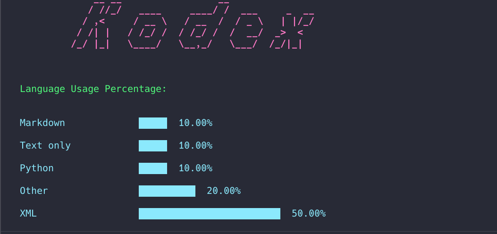

# Kodex
This is a Python script that analyzes the programming languages used in a project directory. It counts the number of files for each language and provides a percentage breakdown.



## Why?
Just thought it could be great if I could check the different languages used in a project from the comfort of my terminal, so decided to write this.

## Features

- Recursively analyzes a specified directory.
- Ignores the `.git` directory and its contents.
- Displays the percentage of files per programming language.

## Requirements

- Python3

## Setting up the Project

1. Fork repository

2. Clone the forked repository in preferred directory

   ```bash
   git clone <project-url>
   ```

3. Enter project directory
  
   ```bash
   cd kodex
   ```

## Running the project

1. Install dependencies

   ### dependencies
   - `pygments`
   - `colorama`
   - `pyfiglet`

   You can install them by running this command
   ```bash
   pip install -r requirements.txt
   ```
2. Run using this command specifying the directory to be analyzed.
   Replace python with the appropriate command for your python version.
   ```bash
   python kodex.py path/to/directory
   ```

## Contributing
If you have any issues running it or will like to contribute/suggest anything, let's meet in the PR or issues section :]